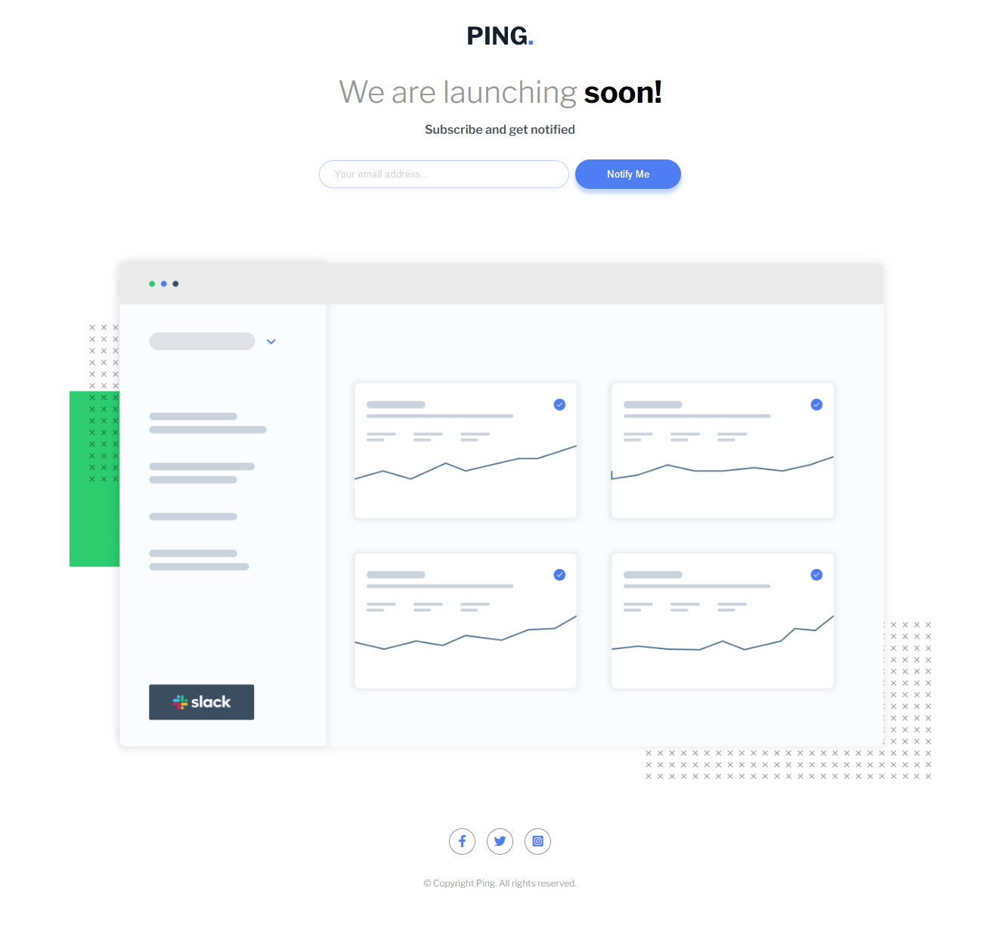

# Frontend Mentor - Ping single column coming soon page

This is a solution to the [Ping single column coming soon page
](https://www.frontendmentor.io/challenges/ping-single-column-coming-soon-page-5cadd051fec04111f7b848da). Frontend Mentor challenges help you improve your coding skills by building realistic projects.

## Table of contents

- [Overview](#overview)
  - [The challenge](#the-challenge)
  - [Screenshot](#screenshot)
  - [Links](#links)
  - [Installation](#Installation)
  - [Usage](#Usage)
- [My process](#my-process)
  - [Built with](#built-with)
  - [What I learned](#what-i-learned)
  - [Continued development](#continued-development)
- [Author](#author)
- [Acknowledgments](#Acknowledgments)

## Overview

### The challenge

This challenge is great for beginners and offers a chance to practice basic client-side form validation.

Your users should be able to:

- View the optimal layout for the interface depending on their device's screen size
- See hover and focus states for all interactive elements on the page
- Receive an error message when the form is submitted if:
  - The input field is empty
  - The email address is not formatted correctly

### Screenshot



### Links

- Solution URL: [here](https://github.com/olahasan/HTML_CSS_AND_J.S_Frontend-Mentor_NEWBIE-Ping-coming-soon-page)

- Live Site URL: [here](https://github.com/olahasan/HTML_CSS_AND_J.S_Frontend-Mentor_NEWBIE-Ping-coming-soon-page/settings/pages)

## Installation

To get a local copy up and running, follow these simple steps:

1. **Clone the repository**:

   ```sh
   git clone https://github.com/your-username/your-repo-name.git
   ```

2. **Navigate to the project directory**:

   ```sh
   cd your-repo-name
   ```

3. **Open the project in your preferred code editor**.

## Usage

To use the components in your project, you can simply copy the HTML, CSS, and JavaScript files into your project directory. Make sure to link the CSS and JS files correctly in your HTML.

## My process

### Built with

- Semantic HTML5 markup
- CSS custom properties
- Flexbox
- CSS Grid
- Mobile-first workflow
- Font Awesome - For icons
- Google Fonts - For fonts
- JavaScript

### What I Learned

In this project, I learned how to:

- Create responsive layouts using media queries.
- Implement form validation using JavaScript.

Here's a snippet of the JavaScript code for form validation:

```javascript
const validateEmail = (email) => /^[^\s@]+@[^\s@]+\.[^\s@]+$/.test(email);

const showError = () => {
  error.classList.remove("hide");
  inputEmail.setAttribute("aria-invalid", "true");
};

const hideError = () => {
  error.classList.add("hide");
  inputEmail.removeAttribute("aria-invalid");
};

document.forms[0].onsubmit = (e) => {
  if (!validateEmail(inputEmail.value)) {
    showError();
    e.preventDefault();
  }
};

inputEmail.onclick = hideError;
```

### Continued Development

In future projects, I plan to:

Explore more advanced form validation techniques.
Improve accessibility by adding more ARIA attributes.
Experiment with CSS animations to enhance user experience.

### Author

Frontend Mentor - @olahasan<br>
GitHub - @olahasan

### Acknowledgments

I would like to thank the **Frontend Mentor** for providing this challenge and to the community for their support and feedback
